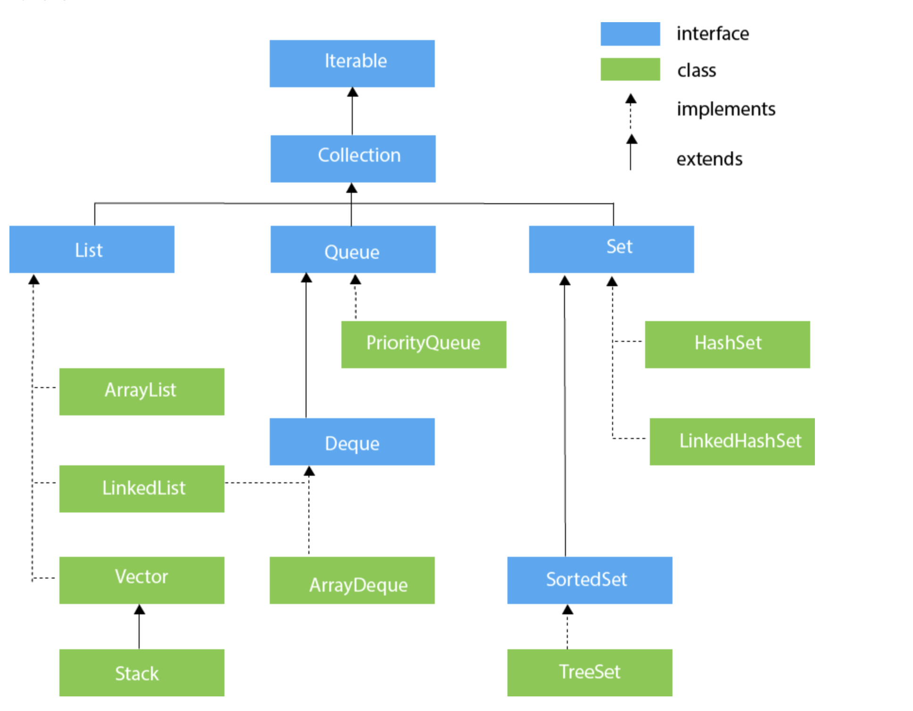

# Hierarchy of Collection Framework
Common java collections and their most useful methods.



## 1. ArrayList
- It is dynamic array(like vector in c++).
- Does not work with premitive data types, need to use wrapper class.

```java
ArrayList<int> al = ArrayList<int>(); // does not work  
ArrayList<Integer> al = new ArrayList<Integer>(); // works fine
```

***Common Used Methods***
- void add(int index, E element)
- boolean add(E e)
- void clear()
- E get(int index)
- E set(int index, E element)
- boolean isEmpty()
- Iterator()
- Object[] toArray()
- boolean contains(Object o)
- E remove(int index)
- boolean remove(Object o)
- int size()

```java
Example

List<String> list=new ArrayList<String>();
list.add("Mango");  
list.add("Apple");

list.get(1);
list.set(1,"Dates");

Collections.sort(list);

//Traversing list through Iterator  
Iterator itr=list.iterator();
while(itr.hasNext()){ 
  System.out.println(itr.next());
}

list.remove(0);
```

## 2. LinkedList
- Java LinkedList class uses a doubly linked list to store the elements.
- Java LinkedList class can be used as a list, stack or queue.

```java
  LinkedList<String> al=new LinkedList<String>();
```

***Common Used Methods***
- boolean add(E e), void add(int index, E element), void addFirst(E e), void addLast(E e)
- void clear()
- E get(int index), E getFirst(), E getLast()
- boolean offer(E e), boolean offerFirst(E e), boolean offerLast(E e)
- E peek(), E peekFirst(), E peekLast()
- E poll(), E pollFirst(), E pollLast()
- E remove(), E remove(int index), boolean remove(Object o), E removeFirst(), E removeLast()
- E set(int index, E element)

## 3. Stack
```java
Stack<type> stk = new Stack<>();
```

***Common Used Methods***
- push(E item)
- pop()
- peek()
- empty()
- size()

  ```java
  Iterate by forEach
  public static void main(String args[]) {
    Stack <Integer> stk = new Stack<>();  
 
    stk.push(119);  
    stk.push(203);  
    stk.push(988);  

    stk.forEach(n ->  {  
        System.out.println(n);}
    );  
    }

  Iterate by Iterator
      Stack <Integer> stk = new Stack<>();  
   
      stk.push(119);  
      stk.push(203);  
      stk.push(988);  

      Iterator iterator = stk.iterator();  
      while(iterator.hasNext())  
      {  
          Object values = iterator.next();  
          System.out.println(values);   
      }
```


 
  


