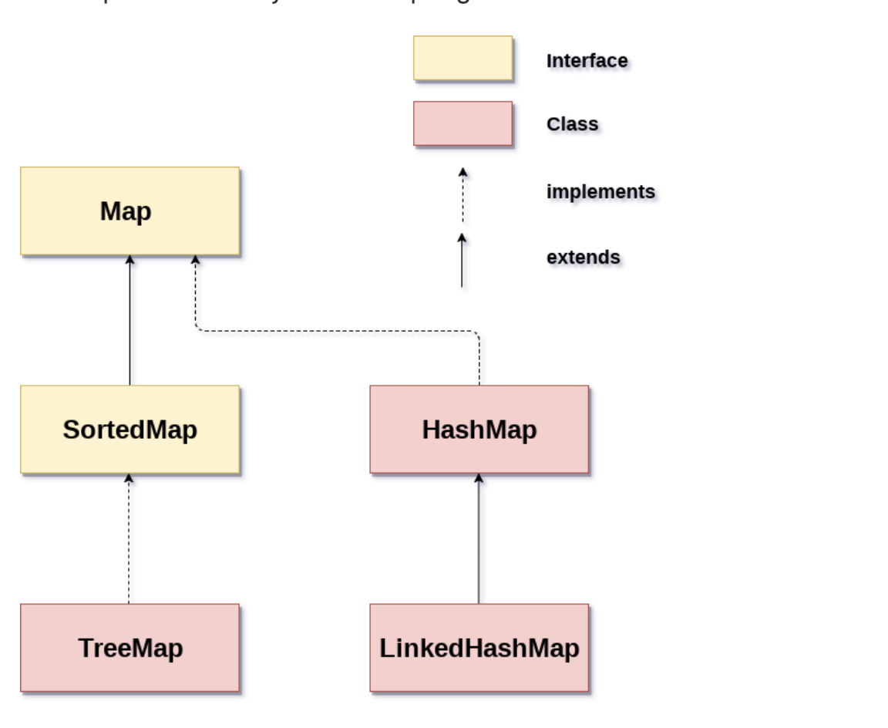
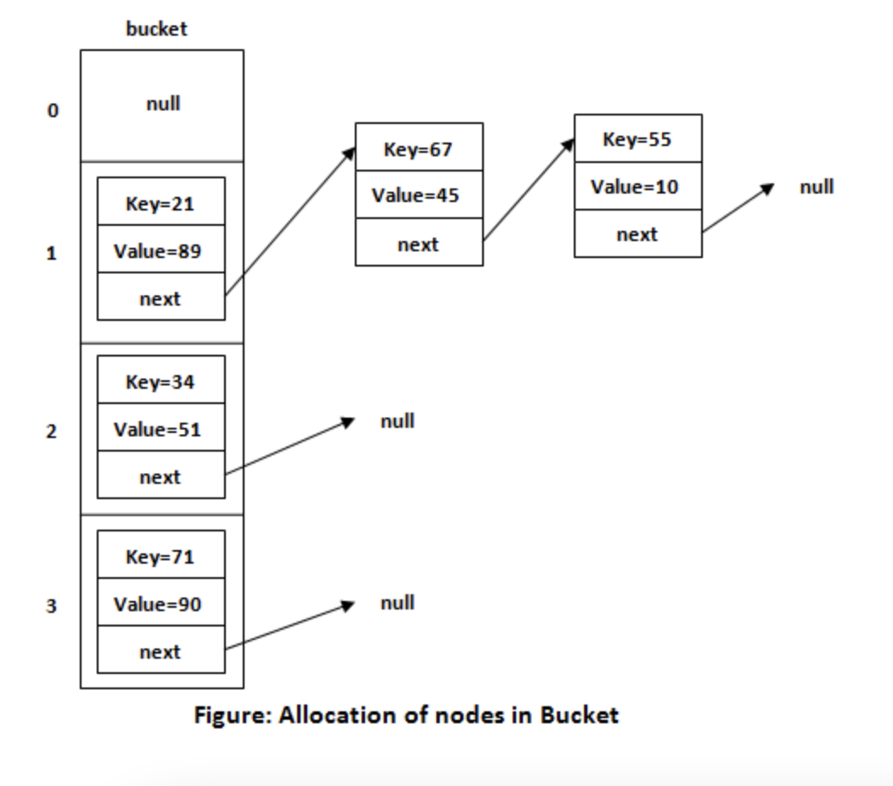

# Hierarchy of Collection Framework
Common java collections and their most useful methods.


## 1. ArrayList
- It is dynamic array(like vector in c++).
- Does not work with premitive data types, need to use wrapper class.

```java
ArrayList<int> al = ArrayList<int>(); // does not work  
ArrayList<Integer> al = new ArrayList<Integer>(); // works fine
```

***Constructors***
- ArrayList(), ArrayList(Collection<? extends E> c), ArrayList(int capacity)

***Common Used Methods***
- void add(int index, E element), boolean add(E e)
- E get(int index), E set(int index, E element)
- E remove(int index), boolean remove(Object o)
- int size(), void clear(), boolean isEmpty()
- boolean contains(Object o)
- Object[] toArray()
- Iterator()

```java
Example

List<String> list=new ArrayList<String>();
list.add("Mango");  
list.add("Apple");

list.get(1);
list.set(1,"Dates");

Collections.sort(list);

//Traversing list through Iterator  
Iterator itr=list.iterator();
while(itr.hasNext()){ 
  System.out.println(itr.next());
}

list.remove(0);
```

## 2. LinkedList
- Java LinkedList class uses a doubly linked list to store the elements.
- Java LinkedList class can be used as a list, stack or queue.

```java
  LinkedList<String> al=new LinkedList<String>();
```

***Constructors***
- LinkedList(), LinkedList(Collection<? extends E> c)

***Common Used Methods***
- boolean add(E e), void add(int index, E element), void addFirst(E e), void addLast(E e)
- void clear()
- E get(int index), E getFirst(), E getLast()
- boolean offer(E e), boolean offerFirst(E e), boolean offerLast(E e)
- E peek(), E peekFirst(), E peekLast()
- E poll(), E pollFirst(), E pollLast()
- E remove(), E remove(int index), boolean remove(Object o), E removeFirst(), E removeLast()
- E set(int index, E element)

## 3. Stack

***Constructors***
- Stack()
  
***Common Used Methods***
- push(E item), pop(), peek(), empty(), size()

```java
  //Iterate by forEach
  public static void main(String args[]) {
    Stack <Integer> stk = new Stack<>();  
 
    stk.push(119);  
    stk.push(203);  
    stk.push(988);  

    stk.forEach(n ->  {  
        System.out.println(n);}
    );  
    }

  //Iterate by Iterator
    Stack <Integer> stk = new Stack<>();  
 
    stk.push(119);  
    stk.push(203);  
    stk.push(988);  

    Iterator iterator = stk.iterator();  
    while(iterator.hasNext())  
    {  
        Object values = iterator.next();  
        System.out.println(values);   
    }
```

## 4 HashSet
- Store element by using hashing.
- Contains unique value, allows null.
- Initial capacity - 15, Load Factor - 0.75.
      
***Constructors***
- HashSet(), HashSet(int capacity), HashSet(int capacity, float loadFactor), HashSet(Collection<? extends E> c).

***Common Used Methods***
- add(E e), clear(), contains(Object o), isEmpty(), remove(Object o), size().

```java
  List<String> list = new ArrayList<>(Arrays.asList("One", "Two", "Three", "Four"));
  Set<String> st = new HashSet(list);  
      
  Iterator<String> it = st.iterator();  
  while(it.hasNext()){  
      System.out.println(it.next());  
  }
```

## 5. LinkedHashSet
- Same Like Hashset, it maintains insertion order.


## 6. TreeSet
- Contains unique element, does not allow null.
- Maintains order.
- User BST for implementation, search, insert - O(logn)

***Constructors***
- TreeSet(), TreeSet(Collection<? extends E> c), TreeSet(SortedSet<E> s), TreeSet(Comparator<? super E> comparator)
 
***Common Used Methods***
- add(E e), addAll(Collection<? extends E> c), ceiling(E e), floor(E e), first(), last(), size(), contains(), clear(), remove(E e), pollFirst(), pollLast().


## 7. Priority Queue
 
***Common Used Methods***
- offer(E e), poll(), peek(), size(), remove(E e)

```java
//min priority queue
 Queue<String> queue=new PriorityQueue<String>();

//max priority queue
PriorityQueue<Integer> queue = new PriorityQueue<>(10, Collections.reverseOrder());

//Implement PriorityQueue through Comparator
```java
PriorityQueue<Student> pq = new PriorityQueue<Student>(5, new StudentComparator());
class StudentComparator implements Comparator<Student>{
    public int compare(Student s1, Student s2) {
        if (s1.cgpa < s2.cgpa)      return 1;
        else if (s1.cgpa > s2.cgpa)     return -1;
        return 0;
    }
}

//Implement PriorityQueue through Comparable
public class Student implements Comparable<Student> {
    String name;
    int age;

    public Student(String name, int age) {  
        this.name = name;
        this.age = age;
    }
    public int compareTo(Student other) {
        return Integer.compare(this.age, other.age);
    }
    @Override
    public String toString(){
        return this.name + " - " + this.age;
    }

    public static void main(String arg[]) {
        PriorityQueue<Student> pq = new PriorityQueue<Student>();

        pq.add(new Student("a", 24));
        pq.add(new Student("b", 20));
        pq.add(new Student("c", 28));

        System.out.println(pq.poll()+" "+pq.poll()+" "+pq.poll());
    }
}
```

## 8. Array Dequeue
- Doubly ended queues, insertion and deletion supported on both the end.
- Linked list is also a Dequeue.

```java
Deque<String> deque = new ArrayDeque<String>();
```
 
***Common Used Methods***
- add(), offer()
- peek(), peekFirst(), peekLast()
- poll(), pollFirst(), pollLast()
- offer(), offerFirst(), offerLast()
- remove(), removeFirst(), removeLast()


# Java Map Hierarchy
- Map in Java is an interface available in java.util package and it stores the data in key and value pairs.
- It does not allow duplicate keys.
- ***It is not subtype of the Collections interface.***



## 1. Hashmap
- Stores unique key, can have on null key.
- Initial capacity - 16, Load factor - 0.75

***Constructors***
- HashMap(), HashMap(Map<? extends K,? extends V> m), HashMap(int capacity), HashMap(int capacity, float loadFactor)
  
***Common Used Methods***
- clear(), isEmpty(), size()
- entrySet(), keySet(), 
- put(Object key, Object value), V putIfAbsent(K key, V value)
- get(Object key), getOrDefault(Object key, V defaultValue)
- containsKey(Object key), containsValue(Object value)
- remove(Object key), remove(Object key, Object value)
- Collection<V> values()

```java
HashMap<Integer,String> mp=new HashMap<>();
mp.put(1,"Mango");
mp.put(2,"Apple");    
mp.put(3,"Banana");   
   
for(Map.Entry m : mp.entrySet()){    
    System.out.println(m.getKey()+" "+m.getValue());    
}
```

***Internal working of HashMap**
- It uses an array and LinkedList data structure internally for storing Key and Value.


## 2. LinkedHashmap
- Everything same as HashMap, it just maintain insertion order.

```java
 LinkedHashMap<Integer,String> hm=new LinkedHashMap<Integer,String>();
```

## 3. Treemap


  


 
  


